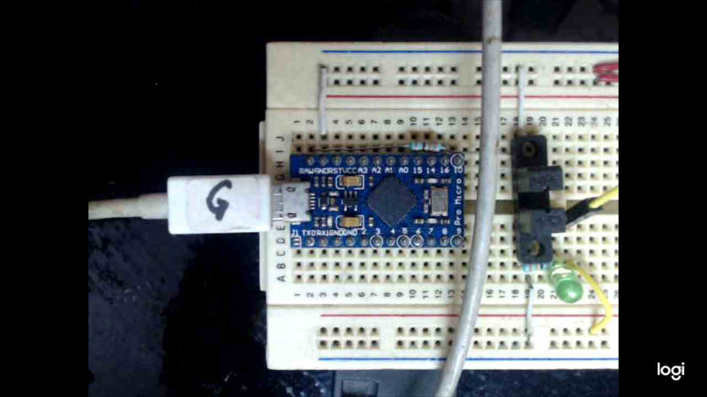

# Due Logs In
Based on a keyboard emulation using an Arduino Due, this firmware logs into a known-password user session. 
Additionally, it can perform some other custom actions by having the ability to send keyboard pressing actions.

This firmware is compatible with any 32u4 based on uController such as the Arduino micro.

## How to set a custom password for logging.
1. Change the value of the 'password' variable in line 25.
2. Upload the firmware following the steps to program an Arduino due previously mentioned. 
3. Connect the Arduino Due to the PC using its Native USB port and enjoy it. 

## What can this firmware do?
This firmware can be modified to get the device:
- Starting applications
- Opening cmd or powershell instances to run bash/powershell commands.
- Launching text editors and writing texts on them.
- Shutdown the PC after performing certain action.
- Etc..

## What it looks like?

